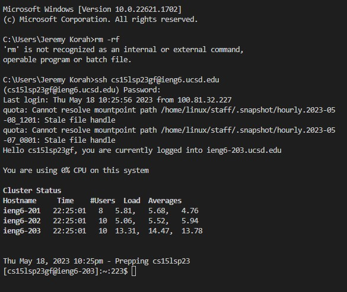
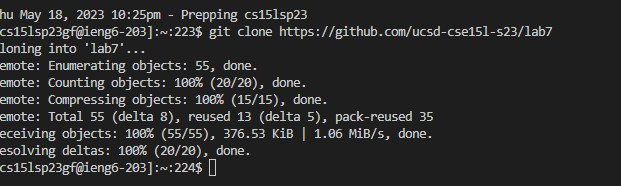
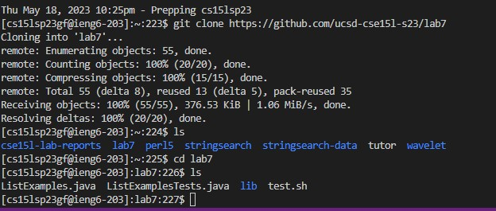
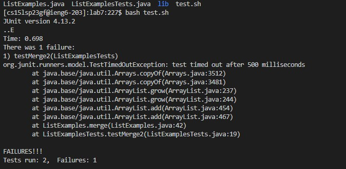
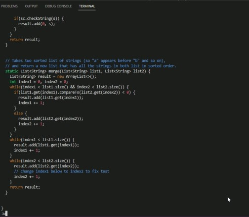
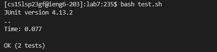
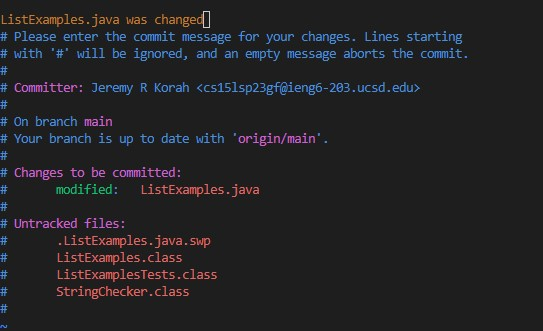
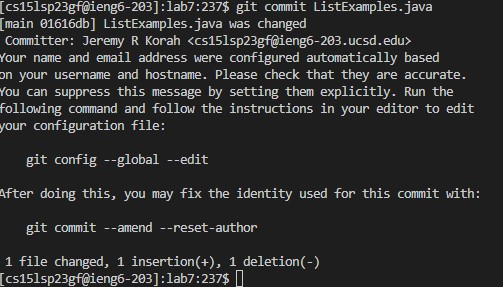

# Lab Report 4:
---
### Step 4: 

Steps: So far I have started by logging into ieng6 typing `ssh cs15lsp23zz@ieng6.ucsd.edu`. I didn't have to enter my password here because it was saved by generating an ssh key for leng. This is done by first typing `ssh-keygen` in the local terminal. Then keep entering <Enter> until the program shows some text it calls the "randomart image". Now, log into your remote course specific account on ieng6. Then run `mkdir .ssh` in the terminal and logout of the remote account. Scroll up a bit to where you were creating the SSH key,find the line where it says: `Your public key has been saved in: <path to your public SSH key>`, copy the path. Make sure you get the public key file, ending in `.pub`, here, not the private file.
From your local computer, run `scp <path to your public SSH key> cs15lsp23__@ieng6.ucsd.edu:~/.ssh/authorized_keys`
Enter password when prompted (this will be the last time you have to type it!) If there is nothing showing when you type your password, don't worry! It's just invisible! Keep typing as you normally do and hit enter. 
Try to log onto your remote account again, you shouldn’t be prompted for a password anymore. 

### Step 5:
Steps: I then proceeded to clone the fork of the repository by typing `git clone https://github.com/ucsd-cse15l-s23/lab7` into the terminal which outputted:

Then I typed `ls` to view the files within the cloned repository and then `cd lab7` to change into the lab7 directory and then finally `ls` to view the files within lab7: 

### Step 6:
I saw the file test.sh and ran it by typing `bash test.sh` into the terminal. 

### Step 7:
Steps: I typed `vim ListExamples.java` into the terminal then hit `<enter>`. The I typed, in order, `<k><l><l><d><w><i><index2><Spacebar><esc><:wq>`. Those commands changed "index1" to "index2" then `:wq` saved the changes. 
Each keystroke I used served a purpose in navigating or served some other useful purpose allowing me to complete the changes I needed to. Here is a full list of vimm commands with explanations included: [vim commands](https://vimm.rtorr.com/). To find explanations of the command I used specifically, use ctrl F and type in the command you wish to see explained. Then hit enter and enjoy learning!

### Step 8: 
Steps: Once again, just like in step 6 , I typed `bash test.sh` to see if the tests were now successfull, which they were.

### Step 9:
Steps: Finally, I typed `git commit ListExamples.java` and hit `<enter>`, commiting and pushing the changes made to ListExamples.java.

